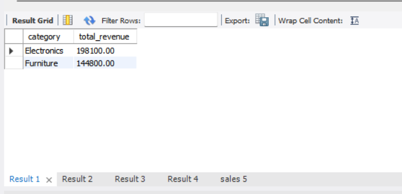
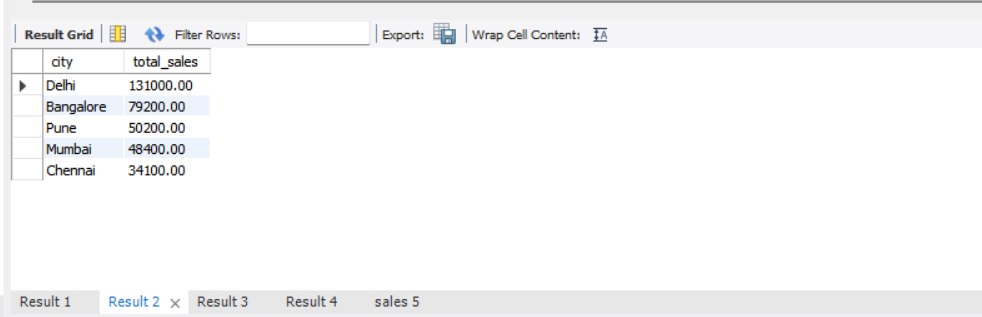
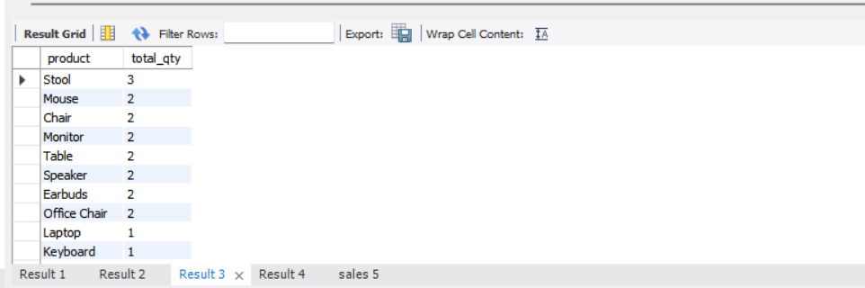
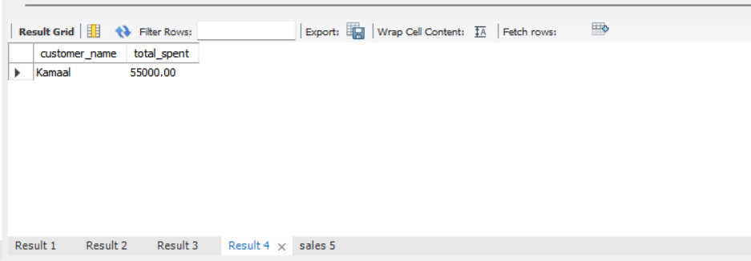
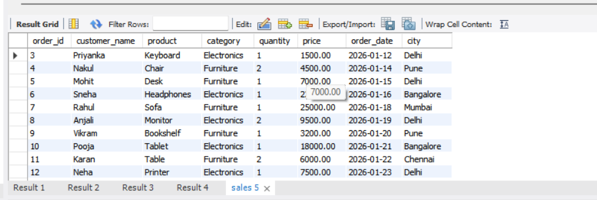

# SQL Sales Analysis

A beginner-level SQL project analyzing sales data using SQL queries.

## Dataset
`database.sql` creates a `sales` table with the following columns:
- order_id, customer_name, product, category, quantity, price, order_date, city

## Analysis Performed
`queries.sql` contains the following analysis:
- Total revenue by category
- City-wise total sales
- Top selling product by quantity
- Highest spending customer
- Filtering orders by date

## SQL Concepts Used
- SELECT, WHERE, GROUP BY, ORDER BY
- Aggregate functions (SUM)
- Column aliasing (AS)

## Tools
MySQL / any relational database

## Author
Kamaal Khan

## Sample Query Results

**Total Revenue by Category**

**City-wise Total Sales**

**Top Selling Products**

**Highest Spending Customer**

**Orders After a Specific Date**

